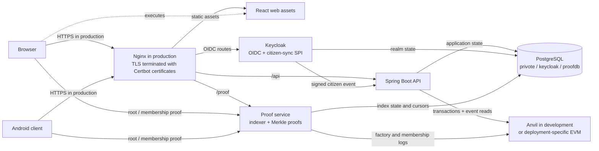
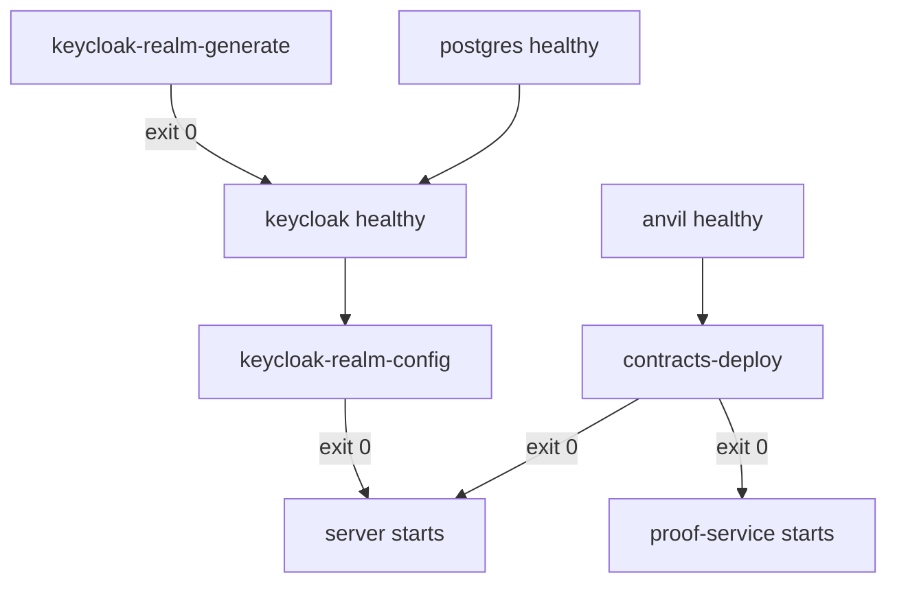

# Architecture

Privote separates verified identity from anonymous voting. Keycloak and the backend know whether a
person is eligible; the election contract validates an election-specific zero-knowledge proof and
nullifier without needing the voter's Keycloak identity.

## System context



The development topology is defined by the merged `compose.yaml` and `compose.dev.yaml`. The
production overlay changes environment-specific behavior, but [production readiness](production.md)
requires more than a valid merged YAML file.

## Components

| Component | Responsibility | Durable state |
| --- | --- | --- |
| `client` | OIDC login, election UI, local identity derivation, ballot encryption, browser proof generation | Browser storage and user-held election vault files |
| `mobile_client` | Android OIDC client, identity vault, native proof and voting flows | Android application storage |
| `server` | Authorization, citizens, elections, registration, relayed chain transactions, receipts, and chain reconciliation | `privote` PostgreSQL database |
| `keycloak` | Users, credentials, sessions, roles, OIDC clients, and the running `citizen-sync` provider | `keycloak` PostgreSQL database |
| `keycloak-synchronizer` | Keycloak provider JAR that signs and sends selected user changes to the backend | No independent store |
| `proof-service` | Discovers elections, indexes membership events, rebuilds Merkle trees, checks roots, and serves proofs | `proofdb` PostgreSQL database |
| `foundry` | Solidity source, tests, deployment scripts, circuit source, local Anvil state | `foundry/anvil-state.json` in development |
| `mopro-semaphore` | Rust witness/proof bridge used by Android | Build artifacts only |

PostgreSQL is shared as a server process for convenience, but the three databases have separate
owners. This is logical isolation, not the same failure isolation as three database servers.

## Identity and citizen synchronization

1. A web or mobile user authenticates in the `privote` Keycloak realm.
2. Keycloak emits supported user or admin events. The custom provider handles registration,
   profile update, email verification, and administrative user create/update events.
3. After Keycloak's transaction commits, the provider constructs a citizen payload.
4. It serializes that payload to JSON and signs those exact bytes with HMAC-SHA-256 using
   `SYNC_SECRET`, then sends them to `POST /api/internal/sync`.
5. The backend verifies the timestamp, signature, and short replay window, and only then parses
   and validates the body before updating the citizen record.

### The signed representation

The HMAC covers:

```
v1.<unix-seconds>.<exact request body bytes>
```

`v1` is a literal and the timestamp is decimal digits, so a verifier can always locate the first two
`.` separators reading left to right. Everything after them is opaque. The scheme is deliberately
free of any per-field structure:

- **the signed bytes are the transmitted bytes.** There is no separate canonicalisation step for a
  sender and a receiver to disagree about, and nothing is trimmed, reordered or normalised on either
  side. The bytes the backend authenticates are the bytes it goes on to parse.
- **verification precedes parsing.** The controller takes the body as `byte[]`, never as a
  deserialized DTO, so an unauthenticated request is rejected before any JSON parser touches it.
  Bean validation runs afterwards, on an already-authentic payload.

This replaced a scheme that signed trimmed `key=value` pairs joined by newlines. That form was
ambiguous: a citizen whose birth place contained a newline could shift the apparent field
boundaries, so two different payloads could produce one signed representation. The two modules share
no code, so the format is pinned from both ends by a golden vector -- a fixed body, timestamp and
secret asserted in `SyncRequestSigningTest` (provider) and `SyncRequestAuthenticatorTest` (backend).
A change on either side fails exactly one of them and names the culprit.

Rotating `SYNC_SECRET` is not a rolling operation: the provider and the backend must be restarted
with the same value, and signatures made with the old secret are rejected from the moment the
backend restarts.

### Citizen attribute names

Four attributes cross the Keycloak boundary, and their names are a contract shared by four places:

| Where | What it does |
|---|---|
| `server/docker/keycloak/generate-realm.py` | Declares them in the realm's user profile and maps them to token claims |
| `KeycloakUserAttributes` (backend) | Names used by the Admin API writes |
| `CitizenAttributes` (synchronizer) | Names the listener reads back off the user |
| `CitizenSyncRequest` | The wire payload |

The canonical spellings are `cin`, `birthDate`, `birthPlace` and `phoneNumber`.

A mismatch here fails silently, which is why it is worth stating explicitly. Keycloak 24+ discards
attributes the declarative user profile does not declare, and `getFirstAttribute` returns `null` for
a name nobody wrote -- so a casing drift produces a citizen record with missing fields rather than
an error. `just test-realm` fails the build if the four sources stop agreeing.

`address` and `region` are deliberately **not** Keycloak attributes. They are application profile
data, persisted only in the backend database, absent from every token, and absent from the sync
payload. The mapper leaves them untouched, so a sync round trip does not blank them out.

The provider does not perform a bulk replay at startup and does not currently use a durable retry
queue. Enabling it for a realm containing old users will not synchronize those users retroactively;
update/re-save each affected user or add a deliberate reconciliation tool. A temporary backend
failure can also require the triggering user change to be repeated.

Installing the provider JAR and enabling the listener are separate operations:

- the custom Keycloak image builds the synchronizer and installs the JAR before `kc.sh build`;
- `keycloak-realm-generate` writes a secret-bearing realm JSON into a Docker volume before Keycloak
  starts;
- the generated realm JSON enables the listener for fresh realms; and
- `keycloak-realm-config` ensures it is present in the listener list of an already-persisted realm.

See [Configuration: Keycloak realm lifecycle](configuration.md#keycloak-realm-lifecycle).

## Election and voting flow

The concise lifecycle is:

1. An administrator creates an election. The client creates the election encryption material and
   the backend deploys an `Election` through `ElectionFactory`.
2. An authenticated voter derives an election-specific Semaphore identity locally and submits
   only its public commitment.
3. The backend, acting as the on-chain coordinator/relayer, adds the commitment to the election's
   Semaphore group.
4. The proof service discovers the election from `ElectionFactory`, indexes `MemberAdded` events,
   and persists its cursor and group state.
5. The client requests a Merkle proof, encrypts its ballot, and produces a Groth16 proof whose
   message is bound to the ciphertext and whose scope is bound to the election.
6. The backend relays `castVote`. The contract verifies the proof and rejects a reused nullifier.
7. The backend and proof service consume chain events for their respective local views.

For the contract interfaces and exact public-signal convention, see
[Smart contracts](smart-contracts.md).

## Why setup services exit

`keycloak-realm-config` and `contracts-deploy` are initialization jobs expressed as Compose
services. They are not daemons.



This model provides three useful guarantees:

- configuration is performed through the same headless path on a laptop or SSH-only server;
- the backend does not start against a realm missing its listener; and
- chain consumers do not start until the configured factory has been verified or deployed.

The names describe the jobs; the runtime behavior remains in Keycloak and on the EVM chain.

`keycloak-realm-generate` is also a one-shot job. It creates first-boot input rather than modifying
an existing realm. Its successful exit is required before Keycloak starts.

## Deployment decisions

The deployment shape is intentionally explicit so contributors do not silently substitute a
different platform:

| Concern | Selected design | Consequence |
| --- | --- | --- |
| Production target | One Linux server over SSH | Compose is the application orchestrator; this is not a multi-host HA design |
| Reverse proxy | Nginx with Certbot-managed certificates | Only Nginx publishes `80` and `443`; certificate issuance/renewal is an operator responsibility |
| Environment selection | `compose.yaml` plus exactly one overlay | `compose.dev.yaml` and `compose.prod.yaml` are selected explicitly, never inferred |
| Command interface | `just` recipes | `just` shortens reviewed Compose commands; Docker Compose remains the source of truth |
| Development contracts | Persistent Anvil plus one-shot `contracts-deploy` | The chain stays running; deployment is verified before consumers start |
| Keycloak provisioning | Built-in provider image, generated first-boot realm, idempotent listener job | No admin-console click is required on an SSH-only host |
| Persistence | Development bind mounts; production named volumes | Local state is visible during development; production data is managed independently of a checkout |
| Secrets | `.env` for development; `/etc/privote/prod.env` mode `600` for production | Secrets remain outside Git, but file access and backups still need operating-system controls |
| PostgreSQL | Major version pinned to 18 | Upgrades require an explicit PostgreSQL migration plan |
| Production EVM | External RPC and pre-deployed contracts | Production does not run Anvil or deploy contracts during application startup |

## Address and trust boundaries

There are three URL namespaces:

| Namespace | Example | Used by |
| --- | --- | --- |
| Host loopback | `http://127.0.0.1:9090` | curl, IDEs, DataGrip, and browsers on the Docker host |
| Compose network | `http://server:9090` | sibling containers only |
| Public origin | `https://api.example.test` | remote browsers/devices and token issuer validation |

Do not substitute one blindly for another. A browser cannot resolve the Compose service name
`keycloak`; a container's `localhost` refers to itself, not the Docker host.

The development overlay publishes HTTP ports on host loopback by default. A process may listen on
`0.0.0.0` *inside* its container so Docker can route traffic to it while the host publication remains
`127.0.0.1:<port>`. Verify host bindings with `docker compose ps` or `docker inspect`, not by treating
`curl 0.0.0.0:<port>` as a remote-exposure test. See [Operations](operations.md#verify-host-port-bindings).

## Persistence and sources of truth

| State | Development location/source | Notes |
| --- | --- | --- |
| PostgreSQL cluster | `server/data/postgres/` | Contains all three databases and stored credentials |
| Keycloak realm | `keycloak` database | Generated realm JSON is first-boot input, not continuous reconciliation |
| Local chain | `foundry/anvil-state.json` | Development only; production uses an external RPC |
| Proof indexes | `proofdb` database | Rebuildable from chain, but cursors and discovered state are persisted |
| Web dependencies | `client_node_modules` Docker volume | Disposable build/development cache |
| Secrets | ignored `.env` or external production env/secret store | Never commit generated realm JSON or real environment files |

Back up the database and chain state before destructive resets. See [Operations: backup and
restore](operations.md#backup-and-restore).

## Current boundaries

- The Compose development stack uses Anvil and deterministic development accounts. Never fund or
  reuse those keys on a public network.
- Startup realm import skips an existing realm. Most realm changes are therefore migrations, not
  edits to a JSON file.
- Citizen synchronization is event-driven and lacks durable retry/reconciliation.
- Flyway owns the application schema (`V1__baseline_schema.sql`); Hibernate only validates it.
  There are no down migrations, so rolling back an application version does not roll back the
  schema.
- The development browser container is a Vite server; the production overlay builds static assets
  and serves them through Nginx.
- Guardian/key-ceremony documents describe work intended for a future decentralized version; do
  not treat them as active production guarantees.
