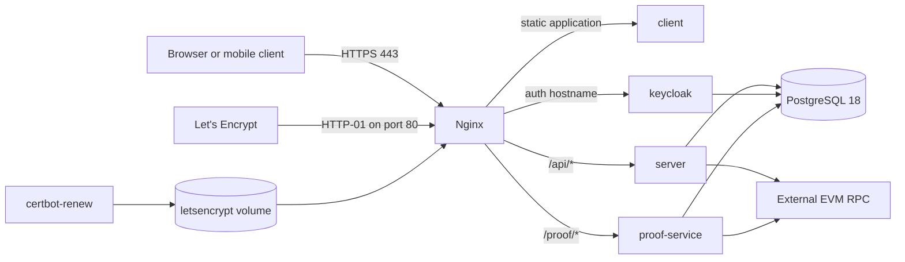

# Production on one Linux server

The production overlay targets one Linux server reached over SSH. It uses Docker Compose for the
application, Nginx for the public edge, Certbot for Let's Encrypt certificates, PostgreSQL 18 in a
named volume, and an external EVM RPC. It deliberately excludes Anvil and automatic contract
deployment.

A successful `docker compose config` proves only that the files merge and required interpolation
values exist. It does not prove schema migrations, DNS, TLS issuance, persisted credentials,
contract identity, backups, or recovery. Complete the blockers and checklist below before serving a
real election.

## Public topology



Only Nginx publishes host ports `80` and `443`. PostgreSQL, Keycloak, the backend, the proof
service, and Keycloak's management port remain on the private Compose network.

The selected public routing is:

| Public URL | Internal destination |
| --- | --- |
| `https://APP_DOMAIN/` | Static React application in `client:80` |
| `https://APP_DOMAIN/api/*` | `server:9090` with the `/api` prefix preserved |
| `https://APP_DOMAIN/proof/*` | `proof-service:4010` with `/proof` removed |
| `https://AUTH_DOMAIN/*` | `keycloak:8080` |

Both domains are included in one certificate named after `APP_DOMAIN`.

## Prerequisites

- A supported Linux host with Docker Engine and the Compose v2 plugin.
- SSH access through a non-root deployment account with narrowly scoped Docker access.
- `just` installed for the documented command interface.
- `A`/`AAAA` records for `APP_DOMAIN` and `AUTH_DOMAIN` pointing to this host.
- Inbound TCP `80` and `443` allowed; SSH restricted to the intended administration sources.
- An external production EVM RPC URL.
- `Groth16Verifier` and `ElectionFactory` deployed separately, reviewed, and recorded.
- An off-host backup destination and a restore procedure.

If a CDN or another load balancer terminates TLS in front of this host, this exact Certbot HTTP-01
design may not apply. Redesign and test the proxy trust chain instead of stacking forwarded headers
without review.

## Environment file

Create the production file outside the repository:

```bash
sudo install -d -o "$(id -un)" -g "$(id -gn)" -m 700 /etc/privote
sudo install -o "$(id -un)" -g "$(id -gn)" -m 600 \
  .env.prod.example /etc/privote/prod.env
"${EDITOR:-vi}" /etc/privote/prod.env
```

Set the file owner to the account that runs the deployment commands while retaining mode `600`.
Replace every `<...>` placeholder and every `example.com` value, then validate that no placeholders
remain:

```bash
rg '<[^>]+>' /etc/privote/prod.env
```

Important production invariants include:

- `POSTGRES_IMAGE` remains pinned to the reviewed PostgreSQL 18 tag;
- `APP_DOMAIN` and `AUTH_DOMAIN` exactly match public DNS and certificate names;
- `KC_ISSUER_URI` is `https://AUTH_DOMAIN/realms/KC_REALM`;
- realm redirect URIs and web origins use the exact production HTTPS domains;
- `COMPOSE_CHAIN_RPC_URL` points to the external production RPC, not Anvil;
- `CHAIN_ID`, `ELECTION_FACTORY_ADDRESS`, and `FACTORY_START_BLOCK` match the recorded deployment;
- `CONFIRMATIONS` is non-zero and appropriate for the selected network;
- `RELAYER_PRIVATE_KEY` belongs to a funded, monitored, deliberately authorized account; and
- development user creation and direct-access grants remain disabled.

Keep the production Compose project name distinct from development if both ever run on the same
machine. This prevents accidental reuse of networks and named volumes.

## Deployment command interface

The production model is always the shared file plus the production overlay:

```bash
just prod-config /etc/privote/prod.env
just prod-cert-init /etc/privote/prod.env
just deploy-prod /etc/privote/prod.env
just prod-cert-renew /etc/privote/prod.env
just prod-logs /etc/privote/prod.env
just prod-down /etc/privote/prod.env
```

The environment-file path is an optional positional recipe argument. Omit it to use the default
`/etc/privote/prod.env`; do not write `env_file=/path`, because Just would treat that whole string as
the filename.

`prod-config`, `prod-cert-init`, `deploy-prod`, and `prod-cert-renew` first run
`deploy/check-env.sh` in production mode. It rejects unreadable files, unresolved `<...>` values,
and files with any group/other permission bits. `prod-down` and `prod-logs` intentionally skip that
preflight so an existing deployment can still be inspected or stopped during configuration repair.

The raw validation command is:

```bash
docker compose --env-file /etc/privote/prod.env \
  -f compose.yaml -f compose.prod.yaml config --quiet
```

The overlay is never selected automatically. A bare `docker compose up` is not the production
interface.

## First TLS certificate

Normal Nginx startup is deliberately blocked by `certificate-check` until certificate files exist.
That prevents an accidental HTTP-only production start. The first certificate needs a short,
explicit bootstrap:

```bash
just prod-cert-init /etc/privote/prod.env
```

The recipe uses the `tls-bootstrap` Compose profile to:

1. start `nginx-bootstrap` on port `80` with only the ACME challenge path available;
2. run `certbot-init` with the webroot challenge for both public domains;
3. store the resulting certificate in the `letsencrypt` named volume; and
4. stop the temporary HTTP-only Nginx service.

Prerequisites for a successful issue request:

- both DNS names already resolve publicly to this host;
- inbound port `80` reaches the host directly;
- no other process owns host port `80`; and
- `ACME_EMAIL` is valid.

Let's Encrypt enforces rate limits. Use staging while rehearsing outside this repository's normal
production command, and do not repeatedly retry a bad DNS or firewall configuration.

After issuance, `certbot-renew` checks periodically using the shared ACME webroot. Nginx reloads
periodically so a renewed certificate is picked up without replacing the container. Monitor renewal
and certificate expiry; a loop that ignores a transient renewal failure is not an alerting system.

Test an on-demand renewal check and immediate Nginx reload with:

```bash
just prod-cert-renew /etc/privote/prod.env
```

## Deploy

After the certificate exists:

```bash
just prod-config /etc/privote/prod.env
just deploy-prod /etc/privote/prod.env
```

The production startup path performs Keycloak realm generation and listener reconciliation, and
verifies the configured chain and factory, but it does not deploy contracts.
`keycloak-realm-generate`, `keycloak-realm-config`, `chain-preflight`, and `certificate-check`
should all complete with exit status `0`.

`chain-preflight` is the production counterpart of the development `contracts-deploy` job: it reads
only, and both `server` and `proof-service` wait for it to succeed. It runs
`foundry/script/verify-deployment.sh`, which rejects a malformed `CHAIN_ID` or
`ELECTION_FACTORY_ADDRESS` (exit `2`), an RPC whose chain ID is not the configured one, an address
with no bytecode, and a factory whose `verifier()` is absent, zero, or not itself deployed. A
misconfigured RPC or a factory address from another network therefore stops the deployment instead
of being discovered after the first vote.

Verify from the host and from an external network:

```bash
curl --fail --show-error https://vote.example.com/
curl --fail --show-error https://vote.example.com/proof/health
curl --fail --show-error \
  https://auth.example.com/realms/privote/.well-known/openid-configuration
```

Replace the example domains and realm with the real values. Then test an OIDC login, an authenticated API call,
a citizen profile update reaching the backend, the configured chain ID/factory, proof indexing, and
an end-to-end vote on the intended pre-production network.

## Edge failure behavior

Nginx resolves application upstreams per request through Docker's embedded DNS at `127.0.0.11`
rather than once at configuration load. This matters for availability rather than performance.

With load-time resolution, a single stopped application container makes the whole edge
configuration invalid, so Nginx refuses to start and its periodic reload fails. That would take the
static application, the authentication hostname, and the `/.well-known/acme-challenge/` path down
together, and a suppressed ACME path eventually costs the certificate as well. Per-request
resolution keeps the failure proportional:

| Condition | Effect |
| --- | --- |
| `server` unreachable | `https://APP_DOMAIN/api/*` returns `502`; every other route is unaffected |
| `proof-service` unreachable | `https://APP_DOMAIN/proof/*` returns `502` |
| `client` unreachable | The static application returns `502`; `/api/*` and the auth host still serve |
| `keycloak` unreachable | `https://AUTH_DOMAIN/` returns `502`; logins fail, the rest of the site serves |
| Any of the above | `nginx -t`, the reload loop, and ACME renewal keep working |

A recreated container that receives a new address is picked up within the ten-second resolver TTL
without restarting Nginx.

Requests carrying an unknown `Host` header, and connections made directly to the server's address,
are refused: port `80` returns nothing (`444`), and port `443` rejects the TLS handshake instead of
presenting the production certificate for a name it does not match.

Production-only services set an explicit `json-file` logging limit of three ten-megabyte files.
Nginx access logging is unbounded by default, which is a slow disk-exhaustion path on a single
server. This is a cap, not a retention policy; ship logs off-host if they are needed after rotation.

## Nginx and Keycloak trust boundary

Nginx terminates TLS and overwrites the forwarded host, protocol, port, and client-address headers
before proxying. Keycloak accepts `xforwarded` headers only from the configured Compose backend
subnet. Keep `BACKEND_SUBNET` synchronized with the network IPAM setting; an overly broad trusted
range lets another container forge public request metadata.

Keycloak runs with a fixed HTTPS hostname and internal HTTP. Never publish Keycloak's port `8080` or
management port `9000` in production. The backend may fetch JWKS through the internal Keycloak URL,
but it must validate the exact public issuer stamped into tokens.

The Keycloak provider is compiled into the custom image before `kc.sh build`. The generated realm
uses exact production URLs, disables the development user, and disables direct password grants.
Startup import still skips an existing realm; it is not a migration engine. Existing redirect URIs,
secrets, roles, users, and security policies must be changed through reviewed Admin REST/`kcadm`
migrations.

## Production blockers

### Database migration release process

Flyway owns the application schema. It runs before Hibernate builds the entity manager, so a clean
production database is bootstrapped from `V1__baseline_schema.sql` at first startup, and
`spring.jpa.hibernate.ddl-auto=validate` refuses to serve a schema that disagrees with the entities.
`baseline-on-migrate` is deliberately `false` in production: an existing schema with no history
table stops the deployment instead of being silently adopted.

What remains deployment work is the release process around those migrations. Test each upgrade from
the previously deployed version rather than only against an empty database; rehearse any destructive
change as its own release; and keep changes expand/contract shaped, as described in
[Configuration: adding a migration](configuration.md#adding-a-migration). There are no down
migrations, so rolling back an application image does not roll back the schema. Do not switch
production to Hibernate `update`.

### Contract assurance

Anvil and `contracts-deploy` exist only in the development overlay. Before production:

1. pin compiler, optimizer, source revision, and dependency versions;
2. run tests, static analysis, and an independent security audit;
3. simulate on a fork or test network;
4. deploy verifier and factory from the approved account;
5. verify source/bytecode where supported; and
6. record addresses, transaction hashes, deployment block, chain ID, and artifact hashes.

The contracts are not currently upgradeable. Define how elections tied to an old factory will be
handled before a replacement is needed.

### Backups and recovery

Named volumes protect state from checkout replacement, not from disk failure, corruption, operator
error, or host loss. Define recovery-point and recovery-time objectives and implement:

- encrypted off-host PostgreSQL backups;
- WAL archiving or another tested point-in-time recovery mechanism;
- restoration of PostgreSQL roles and all three databases;
- Keycloak database consistency and administrative recovery;
- proof-index reconstruction/cursor recovery; and
- quarterly restore exercises with recorded results.

Keycloak realm JSON is first-boot configuration, not a complete runtime backup.

### Operational visibility

Before launch, monitor CPU, memory, disk, database connections, container health, HTTP probes, RPC
health, transaction balance, chain lag, citizen-sync failures, certificate renewal/expiry, and backup
age. Define log retention and redact credentials, tokens, personal data, and private keys.

## Pre-deployment checklist

- [ ] Both DNS names resolve to the intended server.
- [ ] Only SSH and public TCP `80`/`443` are open as intended.
- [ ] `/etc/privote/prod.env` is owned correctly, mode `600`, and contains no placeholders.
- [ ] `just prod-config /etc/privote/prod.env` succeeds.
- [ ] The first certificate exists and automatic renewal has been tested.
- [ ] Stopping one application container degrades only its own routes and leaves ACME reachable.
- [ ] Only Nginx publishes host ports in the production merged model.
- [ ] PostgreSQL is pinned to major version 18 and uses the production named volume.
- [ ] Schema migrations were tested and completed before application startup.
- [ ] Keycloak emits the exact configured HTTPS issuer.
- [ ] Redirect URIs and web origins are exact production HTTPS values.
- [ ] No seed user, `admin/admin`, deterministic Anvil key, or development grant remains.
- [ ] The external RPC, chain ID, factory address, deployment block, and confirmation count agree.
- [ ] The relayer is funded, authorized, monitored, and recoverable.
- [ ] Backups are off-host and a restore was rehearsed.
- [ ] Immutable image tags/digests and a rollback version are recorded.
- [ ] Login, citizen sync, authenticated API, proof indexing, and voting smoke tests pass.

## Upgrade and rollback outline

1. Build and test versioned images in CI.
2. Back up state and record the deployed image digests and configuration revision.
3. Run reviewed database migrations as a separate observable step.
4. Validate the merged Compose model.
5. Deploy the new images.
6. Run the health and end-to-end checks above.
7. Stop the rollout when a defined trigger fails.
8. Roll back images only when schema changes remain backward compatible; otherwise follow the
   migration's documented recovery or forward-fix path.

Compose on one server does not provide multi-host scheduling or automatic high availability. Add a
cluster orchestrator only when measured availability, scaling, or placement requirements justify
its operational cost.
